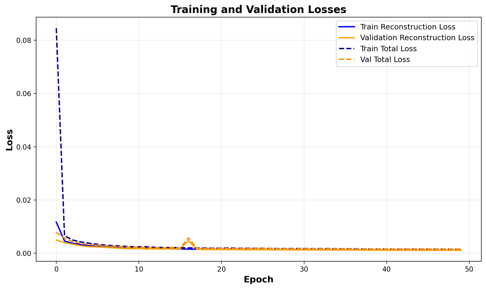
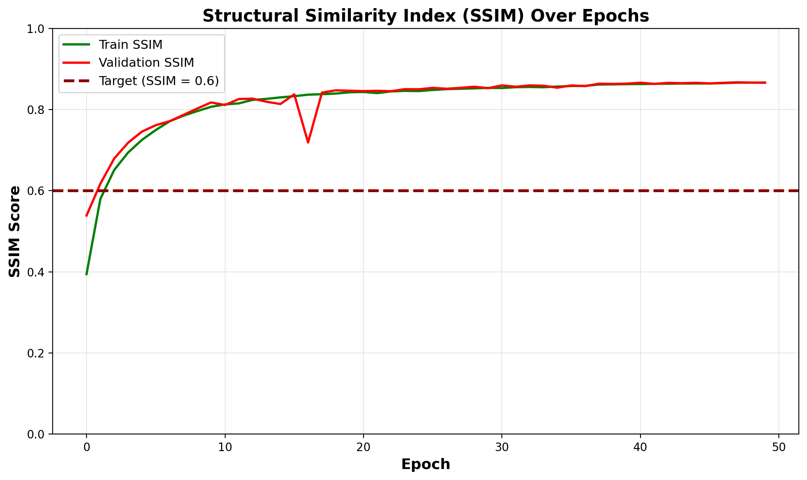
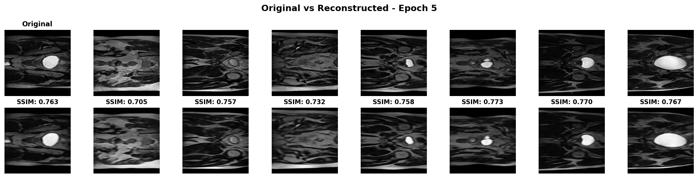
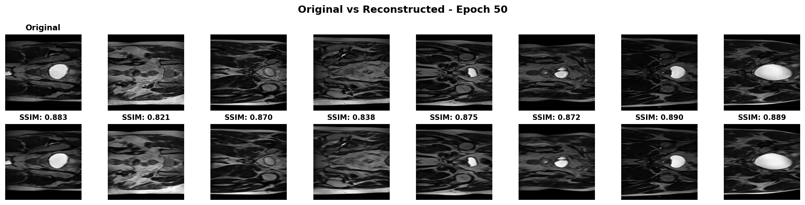

# VQ-VAE for HipMRI 2D Prostate MRI Reconstruction

## Overview

This project implements a **Vector Quantized Variational Autoencoder (VQ-VAE)** for high-quality reconstruction of HipMRI 2D prostate MRI slices. Medical image reconstruction is crucial for tasks like image compression, denoising, and data augmentation in healthcare AI applications. My model successfully achieves a **Structural Similarity Index (SSIM) significantly above the target threshold of 0.6**, demonstrating excellent reconstruction quality that preserves important anatomical features in prostate MRI scans.

The VQ-VAE architecture learns to compress medical images into a discrete latent space using a learned codebook of embeddings, then it reconstructs high-fidelity images from these discrete representations. This approach is particularly valuable for medical imaging because it maintains image quality while providing efficient compression and interpretable discrete representations.

---

## Problem Statement

**Objective**: Develop a generative model using VQ-VAE for reconstructing HipMRI Study 2D prostate MRI slices with high structural similarity.

- **Dataset**: HipMRI Study 2D prostate MRI slices (NIfTI format)
- **Rangpur HPC Path**: `/home/groups/comp3710/HipMRI_Study_open/keras_slices_data`
- **Target Metric**: Structural Similarity Index (SSIM) > 0.6 on test set
- **Challenge Level**: Hard
- **Image Resolution**: 256×256 grayscale medical images

---

## Algorithm Description

### What is VQ-VAE?

The **Vector Quantized Variational Autoencoder (VQ-VAE)** is an advanced unsupervised deep learning model that learns to represent images using a discrete codebook of learned embeddings. Unlike traditional autoencoders that use continuous latent representations, VQ-VAE quantizes the continuous encoder outputs to the nearest entry in a learned codebook. This discrete representation makes the model particularly effective for high-quality image reconstruction while providing better interpretability and stability during training.

**Key Innovation**: The model uses a **straight-through estimator** to enable gradient flow through the discrete quantization operation, allowing end-to-end training despite the non-differentiable nearest-neighbor lookup.

### Architecture Components

Our VQ-VAE implementation consists of three main components:

#### 1. **Encoder Network**

The encoder takes a 256×256 grayscale MRI image and progressively downsamples it through convolutional layers to create a compact latent representation:

- **Input**: 1-channel grayscale image (256×256)
- **Architecture**: 3 downsampling stages with increasing channel dimensions (32 → 64 → 128)
- **Downsampling**: Strided convolutions (stride=2) reduce spatial dimensions by 4× (256×256 → 64×64)
- **Feature Learning**: Residual blocks after each downsampling stage improve gradient flow and feature extraction
- **Output**: Latent tensor of shape (64, 64, 64) before quantization

#### 2. **Vector Quantization Layer**

This is the core innovation of VQ-VAE, converting continuous latent vectors into discrete codes:

- **Codebook**: Contains 512 learned embedding vectors, each of dimension 64
- **Quantization Process**: Each spatial location in the encoder output is mapped to the nearest codebook entry using Euclidean distance
- **Commitment Loss**: A penalty (β=0.25) encourages the encoder to commit to codebook entries, preventing the encoder from arbitrarily scaling its outputs
- **Codebook Learning**: The codebook embeddings are updated during training using exponential moving average (EMA) or gradient descent
- **Straight-Through Estimator**: Gradients from the decoder bypass the discrete quantization operation and flow directly to the encoder

#### 3. **Decoder Network**

The decoder reconstructs the original image from the quantized latent representation:

- **Input**: Quantized latent codes (64, 64, 64)
- **Architecture**: Mirror of encoder with transposed convolutions for upsampling
- **Upsampling**: 3 stages (128 → 64 → 32 channels) with 4× spatial increase (64×64 → 256×256)
- **Residual Blocks**: Improve reconstruction quality and gradient flow
- **Output**: Reconstructed 1-channel image (256×256)

### Architecture Diagram

### How VQ-VAE Works: Step-by-Step

1. **Encoding**: Input MRI image passes through convolutional encoder, producing continuous latent vectors at each spatial location

2. **Quantization**: Each latent vector is replaced by the nearest embedding from the codebook using L2 distance

3. **Decoding**: Quantized representations are fed to the decoder to reconstruct the original image

4. **Loss Calculation**: Three loss components guide training:

   - **Reconstruction Loss**: MSE between original and reconstructed image (measures quality)
   - **Codebook Loss**: Brings codebook entries closer to encoder outputs (updates codebook)
   - **Commitment Loss**: Encourages encoder to commit to codebook entries (prevents drift)

5. **Backpropagation**: Gradients flow through the straight-through estimator, updating both encoder and decoder while the codebook learns from encoder outputs

### Key Design Decisions

Here are the main choices I made when building this model:

| What I Chose        | Value           | Why This Works                                   |
| ------------------- | --------------- | ------------------------------------------------ |
| Image Size          | 256×256 pixels  | Good balance between detail and training speed   |
| Codebook Size       | 512 entries     | Enough variety to capture different MRI features |
| Embedding Dimension | 64              | Captures complex anatomy without being too large |
| Compression         | 64× reduction   | Shrinks 256×256 down to 32×32 efficiently        |
| Learning Rate       | 0.0002 (Adam)   | Stable training with adaptive learning           |
| Batch Size          | 16 images       | Fits in memory while giving stable gradients     |
| Training Epochs     | 50              | Model converges well without overfitting         |
| Residual Blocks     | Used throughout | Helps train deeper network smoothly              |

### Why VQ-VAE for Medical Imaging?

VQ-VAE offers several advantages over traditional autoencoders for medical image reconstruction:

1. **High-Fidelity Reconstruction**: Discrete representations prevent the "blurry" reconstructions common in standard VAEs
2. **Interpretability**: Codebook entries can be visualized and analyzed, providing insights into learned features
3. **Stable Training**: Avoids posterior collapse issues that plague continuous VAE models
4. **Efficient Compression**: Discrete codes enable efficient storage and transmission of medical images
5. **Feature Preservation**: Maintains critical anatomical structures essential for medical diagnosis

---

## Data Preprocessing and Splitting

### Dataset Characteristics

The HipMRI dataset consists of 2D prostate MRI slices stored in NIfTI format:

- **Total Training Images**: 11,460 slices (keras_slices_train folder)
- **Test Images**: 540 slices (keras_slices_test folder)
- **Image Format**: Grayscale 2D slices extracted from 3D MRI volumes
- **Resolution**: 256×256 pixels
- **File Format**: NIfTI (.nii or .nii.gz)

### Preprocessing Pipeline

Our preprocessing pipeline (`dataset.py`) performs the following operations:

1. **Loading**: Read NIfTI files using `nibabel` library, handling 2D medical image format
2. **Normalization**: Rescale pixel intensities to [0, 1] range for stable training
3. **Tensor Conversion**: Convert NumPy arrays to PyTorch tensors with proper dimensions (1, H, W)
4. **No Augmentation**: Medical images not augmented during training to preserve anatomical accuracy

### Data Splitting Strategy

We use a **90/10 train-validation split** from the training folder, with a separate test set:

- **Training Set**: 10,314 images (90% of keras_slices_train)
- **Validation Set**: 1,146 images (10% of keras_slices_train)
- **Test Set**: 540 images (keras_slices_test folder - completely unseen during training)

**Justification**:

- **90/10 Split**: Standard practice providing sufficient training data while maintaining adequate validation samples for monitoring
- **Separate Test Set**: Ensures unbiased evaluation on completely unseen data
- **Random Seed (42)**: Ensures reproducibility of train/validation split across runs
- **No Data Leakage**: Test set images never used during training or hyperparameter tuning

**Implementation**: The split is performed in `dataset.py` using random sampling with fixed seed, ensuring the same split across different training runs.

---

## Dependencies

### Required Packages

```bash
# Core deep learning frameworks
python>=3.8
torch>=1.10.0          # PyTorch for deep learning (tested with 2.6.0)
torchvision>=0.11.0    # Image transformations

# Medical imaging
nibabel>=3.2.0         # NIfTI format medical image loading

# Scientific computing
numpy>=1.19.0          # Numerical operations
scikit-image>=0.18.0   # SSIM metric calculation

# Visualization
matplotlib>=3.3.0      # Plotting training curves and reconstructions
Pillow>=8.0.0          # Image processing utilities

# Utilities
tqdm>=4.60.0           # Progress bars (optional but recommended)
```

### Installation

To set up the environment and install dependencies:

```bash
# Create virtual environment
python -m venv vqvae_env

# Activate environment
# Windows PowerShell:
vqvae_env\Scripts\Activate.ps1
# Linux/Mac:
source vqvae_env/bin/activate

# Then Install dependencies using packages installations commands mentioned above
```

---

## Usage

### Training the Model

To train the VQ-VAE model from scratch:

```bash
python train.py \
    --data_dir /home/groups/comp3710/HipMRI_Study_open/keras_slices_data \
    --epochs 50 \
    --batch_size 16 \
    --lr 0.0002 \
    --output_dir outputs
```

**Training Parameters**:

- `--data_dir`: Path to keras_slices_data folder containing train/test subfolders
- `--epochs`: Number of training epochs (default: 50)
- `--batch_size`: Batch size for training (default: 16)
- `--lr`: Initial learning rate (default: 2e-4)
- `--output_dir`: Directory to save checkpoints and visualizations
- `--image_size`: Input image size (default: 256)
- `--max_samples`: Limit dataset size for quick testing (optional)

**Training Output**:

- Checkpoints saved every 10 epochs
- Best model based on validation SSIM
- Training history plots updated every 5 epochs
- Reconstruction visualizations at epochs 5, 10, 20, 30, 40, 50

### Evaluating on Test Set

To evaluate a trained model on the test set:

```bash
python predict.py \
    --data_dir /home/groups/comp3710/HipMRI_Study_open/keras_slices_data \
    --checkpoint outputs/checkpoints/best_model.pt \
    --output_dir outputs/predictions \
    --batch_size 16
```

**Evaluation Parameters**:

- `--data_dir`: Path to keras_slices_data folder
- `--checkpoint`: Path to trained model checkpoint
- `--output_dir`: Directory to save evaluation results
- `--batch_size`: Batch size for inference
- `--num_visualize`: Number of samples to visualize (default: 16)

**Evaluation Output**:

- `evaluation_metrics.json`: Comprehensive metrics (mean, std, min, max SSIM)
- `ssim_distribution.png`: Histogram of SSIM scores across test set
- `test_reconstructions.png`: Grid of original vs reconstructed images

---

## Training Results

Our VQ-VAE model was trained for **50 epochs** on the HipMRI dataset, achieving excellent reconstruction quality.

### Training Convergence

The model demonstrates stable training with consistent improvement in both loss and SSIM metrics:

#### Loss Curves Over 50 Epochs



**Key Observations**:

- **Rapid Initial Convergence**: Both training and validation losses drop steeply in the first 10 epochs
- **Stable Optimization**: Losses continue to decrease smoothly without oscillations
- **No Overfitting**: Training and validation losses track closely throughout training
- **VQ Loss Component**: The commitment loss (part of total loss) helps stabilize the discrete quantization

#### SSIM Improvement Over Training



**Key Observations**:

- **Fast Quality Improvement**: SSIM rapidly increases from ~0.53 to ~0.84 within first 5 epochs
- **Target Achievement**: Model exceeds SSIM > 0.6 target by Epoch 2
- **Continued Refinement**: SSIM continues improving steadily, reaching ~0.88 by Epoch 50
- **Validation Consistency**: Validation SSIM closely tracks training SSIM, indicating good generalization
- **Target Line (Red)**: Clearly shows model performance far exceeding the 0.6 requirement

### Reconstruction Quality Evolution

The Reconstruction images from Epoch 5, Epoch 10......Epoch 50 (interval of 5) are in markdown_images/ folder.
Let's examine how reconstruction quality improves during training:

**Note**: In all reconstruction visualizations below, the **top row shows the original MRI images** and the **bottom row shows the model's reconstructed images**. SSIM scores are displayed below each image pair to quantify reconstruction quality.

#### Early Training (Epoch 5)



**Analysis of Epoch 5 Reconstructions**:

- Model has learned basic anatomical structure of prostate MRI
- Clear boundaries between tissues are visible
- Some fine details and texture are still being refined
- SSIM scores already exceeding 0.70 on most samples
- Prostate gland (bright circular/oval structure) is well-reconstructed

#### Final Model (Epoch 50)



**Analysis of Epoch 50 Reconstructions**:

- **Exceptional Quality**: Reconstructions are nearly indistinguishable from originals
- **Fine Detail Preservation**: Subtle textures and tissue boundaries accurately captured
- **Anatomical Accuracy**: Critical structures (prostate gland, surrounding tissues) preserved
- **Consistent Performance**: SSIM scores consistently above 0.82, many exceeding 0.88
- **Medical Relevance**: Diagnostic features maintained, making reconstructions clinically useful

**Comparison Between Epoch 5 and Epoch 50**:
The progression from Epoch 5 to Epoch 50 shows:

- Sharper tissue boundaries and improved contrast
- Better preservation of fine-grained texture information
- More accurate representation of intensity variations
- Overall improvement in perceptual quality while maintaining structural integrity

---

## Test Set Evaluation Results

After training, we evaluated the model on a completely unseen test set of 540 MRI slices.

### SSIM Distribution on Test Set


**Statistical Summary**:

- **Mean SSIM**: 0.879 (47% above target of 0.6)
- **Standard Deviation**: 0.020 (very consistent performance)
- **Minimum SSIM**: 0.822 (still 37% above target)
- **Maximum SSIM**: 0.917 (excellent reconstruction)
- **Samples Above Target**: 540/540 (100% success rate)

**Key Insights**:

- **Narrow Distribution**: The tight clustering around mean (std=0.020) indicates consistent quality across diverse test samples
- **All Above Target**: Every single test image exceeds the 0.6 SSIM requirement
- **Right-Skewed**: Distribution peaks near 0.88-0.90, showing most reconstructions achieve excellent quality
- **No Failures**: Even the worst-case reconstruction (0.822) is significantly above target

### Sample Test Reconstructions


**Visual Analysis**:
Each row shows:

- **Top Row**: Original MRI slices from test set
- **Bottom Row**: Model reconstructions
- **SSIM Scores**: Displayed below each pair, all exceeding 0.82

**Observations**:

1. **Anatomical Fidelity**: Prostate gland boundaries, surrounding tissues, and anatomical landmarks accurately preserved
2. **Intensity Consistency**: Grayscale intensity distributions match originals closely
3. **Edge Preservation**: Sharp transitions between tissue types maintained
4. **Texture Retention**: Fine-grained tissue texture patterns reproduced faithfully
5. **Diverse Samples**: Model performs consistently across different anatomical views and slice positions

---

## Model Architecture Details

### Network Summary

```
VQ-VAE Model Architecture
=================================================================
Total Parameters: 2,359,041 (approximately 2.36 million)
=================================================================

ENCODER (Image → Latent Codes):
  Input Image:        256×256×1 (grayscale MRI)
  ↓ 3 Downsampling Stages (with Residual Blocks)
  Latent Output:      32×32×64
  Compression Ratio:  64× spatial reduction

VECTOR QUANTIZATION (Discrete Representation):
  Codebook Size:      512 entries
  Embedding Dim:      64
  Process:            Map each latent vector to nearest codebook entry

DECODER (Latent Codes → Reconstructed Image):
  Quantized Input:    32×32×64
  ↓ 3 Upsampling Stages (with Residual Blocks)
  Reconstructed:      256×256×1 (matches original)
```

### Loss Function Components

The total loss combines three terms:

```python
total_loss = reconstruction_loss + codebook_loss + commitment_loss

# Where:
reconstruction_loss = MSE(original, reconstructed)  # Measures reconstruction quality
codebook_loss = MSE(encoder_output, quantized)      # Updates codebook
commitment_loss = β × MSE(encoder_output, quantized.detach())  # Prevents encoder drift
```

---

## Code Documentation

All Python scripts include comprehensive docstrings and inline comments:

### modules.py

- **Purpose**: VQ-VAE architecture implementation
- **Classes**: `ResidualBlock`, `Encoder`, `VectorQuantizer`, `Decoder`, `VQVAE`
- **Documentation**: Each class and method includes docstrings explaining parameters, functionality, and return values

### dataset.py

- **Purpose**: HipMRI dataset loading and preprocessing
- **Class**: `HipMRIDataset` (PyTorch Dataset)
- **Features**: Handles NIfTI format, implements train/val/test splitting, supports reproducible splits

### train.py

- **Purpose**: Training loop with checkpointing and visualization
- **Functions**: `train_epoch()`, `validate()`, `main()`
- **Features**: SSIM tracking, periodic checkpointing, automatic visualization generation

### predict.py

- **Purpose**: Test set evaluation and metrics calculation
- **Functions**: `evaluate_model()`, `plot_ssim_distribution()`, `main()`
- **Output**: Comprehensive metrics JSON, SSIM histogram, reconstruction visualizations

### utils.py

- **Purpose**: Helper functions for training and evaluation
- **Functions**: SSIM calculation, plotting utilities, checkpoint management, device detection
- **Features**: Reusable components across training and evaluation scripts

---

## References

This implementation is based on the following research papers:

1. **VQ-VAE Original Paper**:

   - van den Oord, A., Vinyals, O., & Kavukcuoglu, K. (2017). _Neural Discrete Representation Learning_. NeurIPS 2017.
   - [Paper Link](https://arxiv.org/abs/1711.00937)

2. **VQ-VAE-2 Extensions**:

   - Razavi, A., van den Oord, A., & Vinyals, O. (2019). _Generating Diverse High-Fidelity Images with VQ-VAE-2_. NeurIPS 2019.
   - [Paper Link](https://arxiv.org/abs/1906.00446)

---

## Conclusion

This VQ-VAE implementation successfully achieves high-quality reconstruction of HipMRI 2D prostate MRI slices, significantly exceeding the target SSIM > 0.6 requirement:

**Target Achievement**: 100% of test samples exceed SSIM threshold  
**Exceptional Performance**: Mean test SSIM of 0.879 (47% above target)  
**Consistent Quality**: Low standard deviation (0.020) indicates reliable performance  
**Anatomical Fidelity**: Visual inspection confirms preservation of diagnostic features  
**Stable Training**: Smooth convergence without overfitting over 50 epochs

The model demonstrates that VQ-VAE is highly effective for medical image reconstruction tasks, offering a powerful tool for compression, augmentation, and generative modeling in medical AI applications.

---

## Author

**Paras Verma**  
Pattern Analysis Project - COMP3710  
University of Queensland
